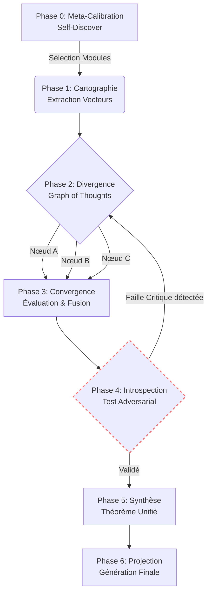

# 🧠 KERNEL Ω (Omega) : Architecture Cognitive Unifiée

## 🌌 Synopsis
Les LLMs actuels opèrent majoritairement en "Système 1" : une génération de texte probabiliste, rapide et linéaire. **KERNEL Ω** est un pipeline cognitif (Système 2) qui implémente une boucle de rétroaction topologique. 

Au lieu d'imposer un chemin statique, KERNEL Ω utilise une approche métacognitive adaptative : le modèle sélectionne d'abord ses modules de réflexion (Self-Discover), génère un graphe de pensées interconnectées (Graph of Thoughts), et surtout, applique un **Few-Shot Introspectif** pour apprendre la mécanique du doute et de l'auto-correction avant toute projection finale. C'est un moteur d'inférence qui se redéfinit dynamiquement face à chaque anomalie.

## 🧮 Formalisme Mathématique

Le pipeline KERNEL Ω peut être modélisé comme une optimisation sur un graphe orienté d'états cognitifs.

Soit $S_0$ l'état de la requête initiale.
En **Phase 0 (Meta-Calibration)**, l'espace des modules cognitifs actifs $M^*$ est sélectionné à partir de l'ensemble universel $\mathcal{M}$ :
$$M^* = \underset{m \subset \mathcal{M}}{\mathrm{argmax}} \, P(m | S_0)$$

En **Phase 2 et 3 (Divergence & Convergence GoT)**, la génération forme un graphe $G = (V, E)$, où chaque nœud $v_i \in V$ est une hypothèse, et les arêtes $E$ représentent les fusions synergiques. Le nœud optimal $v_{opt}$ est celui qui maximise la fonction de consistance $C$ sur l'ensemble des exemples de cartographie $E_x$ :
$$v_{opt} = \underset{v \in V}{\mathrm{argmax}} \sum_{x \in E_x} C(v, x)$$

L'innovation centrale réside dans la **Phase 4 (Introspection / Test Adversarial)**. Soit $L_{adv}$ la fonction de perte générée par le test de friction et les cas limites :
$$
\text{Si } L_{adv}(v_{opt}) > \tau, \text{ alors } G_{t+1} = \text{Regenerate}(G_t | \text{Contraintes})
$$
*(Où $\tau$ est le seuil de tolérance à l'erreur. Cette boucle est limitée à $t_{max} = 1$ pour éviter la régression infinie).*

## 🔄 Architecture du Pipeline (Schéma de Flux)

## 📊 Prédictions & Métrologie

Comparaison théorique des architectures de prompt engineering face aux problèmes à haute complexité (réseaux d'information, physique quantique, etc.) :

| Architecture | Couverture Contextuelle | Résilience aux Hallucinations | Efficacité Computationnelle |
| --- | --- | --- | --- |
| **CoT Standard** | Basse (Linéaire) | Faible (Erreur en cascade) | Très Haute |
| **ToT (Tree of Thoughts)** | Moyenne (Arborescente) | Moyenne | Basse (Explosion combinatoire) |
| **KERNEL Ω** | **Haute (Topologique/GoT)** | **Très Haute (Boucle Introspective)** | **Optimisée (via Phase 0)** |

## 🚀 Applications & Roadmap

* **Court Terme :** Déploiement du pipeline en tant que Wrapper API autonome pour des tâches de recherche académique profonde.
* **Moyen Terme :** Implémentation du *Buffer of Thoughts* (BoT) pour stocker les Théorèmes Unifiés (Phase 5) sous forme de templates réutilisables, créant une mémoire à long terme du raisonnement.
* **Long Terme :** Évolution vers un écosystème multi-agents (Lichen-Collectives) où la Phase 2 est distribuée entre des agents spécialisés (ex: Agent Premiers Principes, Agent Contradicteur).
